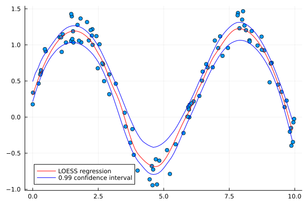

# Loess

[](https://travis-ci.org/JuliaStats/Loess.jl)

This is a pure Julia loess implementation, based on the fast kd-tree based
approximation described in the original Cleveland, et al papers[1,2,3], implemented
in the netlib loess C/Fortran code, and used by many, including in R's loess
function.

## Synopsis

`Loess` exports two functions, `loess` and `predict`, that train and apply the model, respectively. The amount of smoothing is mainly controlled by the `span` keyword argument. E.g.:


```julia
using Loess, Plots

xs = 10 .* rand(100)
ys = sin.(xs) .+ 0.5 * rand(100)

model = loess(xs, ys, span=0.5)

us = range(extrema(xs)...; step = 0.1)
vs = predict(model, us)

scatter(xs, ys)
plot!(us, vs, legend=false)
```



There's also a shortcut in Gadfly to draw these plots:

```julia
plot(x=xs, y=ys, Geom.point, Geom.smooth, Guide.xlabel("x"), Guide.ylabel("y"))
```


## Status

Multivariate regression is not yet fully implemented, but most of the parts
are already there, and wouldn't require too much additional work.

## References
[1] Cleveland, W. S. (1979). Robust locally weighted regression and smoothing scatterplots. Journal of the American statistical association, 74(368), 829-836. DOI: 10.1080/01621459.1979.10481038

[2] Cleveland, W. S., & Devlin, S. J. (1988). Locally weighted regression: an approach to regression analysis by local fitting. Journal of the American statistical association, 83(403), 596-610. DOI: 10.1080/01621459.1988.10478639

[3] Cleveland, W. S., & Grosse, E. (1991). Computational methods for local regression. Statistics and computing, 1(1), 47-62. DOI: 10.1007/BF01890836

