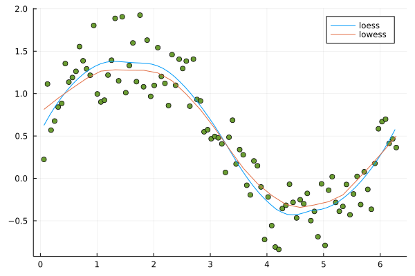

# Loess

[](https://github.com/JuliaStats/Loess.jl/actions/workflows/ci.yml)

This is a pure Julia implementation of the `lowess` and `loess` smoothers.

`loess` is based on the fast kd-tree based
approximation described in the original Cleveland, et al papers[1,2,3], implemented
in the netlib loess C/Fortran code, and used by many, including in R's loess
function.

The Julia code for `lowess` has been hand-translated from the `lowess.c` code at https://github.com/carlohamalainen/cl-lowess/blob/master/lowess.c

## Synopsis

`Loess` exports three functions: `lowess`, `loess` and `predict`.

`loess` and `predict` are functions that train and apply the loess model, respectively. The amount of smoothing is mainly controlled by the `span` keyword argument.

The `lowess` function returns the predicted y-values for the input x-values. The amount of smoothing for this function controlled by the `f` keyword argument. An example plot for these is given below.

```julia
using Loess, Plots, Random
Random.seed!(43)

n = 100
xs = 1:n
xs = (i -> i*2*pi/n).(xs)
ys = sin.(xs) .+ rand(0:999, n) / 1000.0

scatter(xs, ys, legend = false, primary=false)

# Adding loess
model = loess(xs, ys, span=0.5)
us = range(extrema(xs)...; step = 0.1)
vs = predict(model, us)
plot!(us, vs, legend=true, label = "loess")

# Adding lowess
f = 0.3
nsteps = 3
delta = 0.3

zs = lowess(xs, ys, f, nsteps, delta)

plot!(xs, zs, legend = true, label = "lowess")

```



## Status

Multivariate regression is not yet fully implemented, but most of the parts
are already there, and wouldn't require too much additional work.

## References
[1] Cleveland, W. S. (1979). Robust locally weighted regression and smoothing scatterplots. Journal of the American statistical association, 74(368), 829-836. DOI: 10.1080/01621459.1979.10481038

[2] Cleveland, W. S., & Devlin, S. J. (1988). Locally weighted regression: an approach to regression analysis by local fitting. Journal of the American statistical association, 83(403), 596-610. DOI: 10.1080/01621459.1988.10478639

[3] Cleveland, W. S., & Grosse, E. (1991). Computational methods for local regression. Statistics and computing, 1(1), 47-62. DOI: 10.1007/BF01890836

[4] Gordon Smyth (2020). Difference between LOESS and LOWESS.
https://stats.stackexchange.com/users/129321/gordon-smyth
